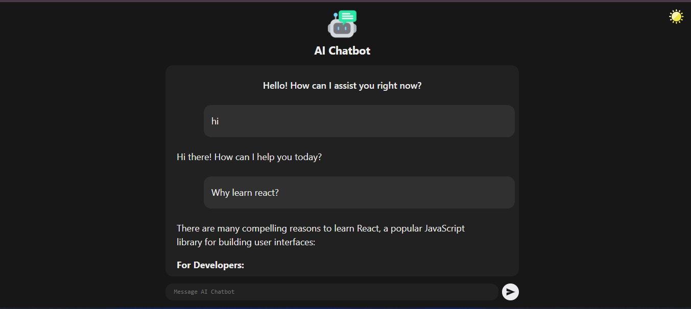

# 🤖 React AI Chatbot

Welcome to **React AI Chatbot**!  
A modern, interactive chatbot built with React, supporting multiple AI providers (Google Gemini, OpenAI, DeepSeek) with real-time streaming and beautiful Markdown rendering.

---

## ✨ Features

- 💬 **Chat with AI** using Google Gemini, OpenAI, or DeepSeek models
- ⚡ **Streaming responses** for instant, real-time interaction
- 📝 **Markdown support** for rich, formatted AI replies
- 🎨 **Responsive & modern UI** — works great on desktop and mobile
- 🔄 **Easily switch AI providers** with a single line change
- 🛡️ **Environment-based API key management** for security

---

## 🚀 Getting Started

### 📦 Prerequisites

- [Node.js](https://nodejs.org/) (v18 or newer recommended)
- [npm](https://www.npmjs.com/)

### 🛠️ Installation

1. **Clone the repository:**
   ```sh
   git clone <your-repo-url>
   cd react-ai-chatbot
   ```

2. **Install dependencies:**
   ```sh
   npm install
   ```

3. **Configure your API keys:**
   ```sh
   cp .env.example .env.local
   # Edit .env.local and add your API keys
   ```

---

## 🏃 Running the App

Start the development server:
```sh
npm run dev
```
The app will be available at [http://localhost:5173](http://localhost:5173) (or as shown in your terminal).


Edit `.env.local` to provide your API keys:
```
VITE_GOOGLE_AI_API_KEY=your_google_api_key
VITE_OPEN_AI_API_KEY=your_openai_api_key
VITE_DEEPSEEK_AI_API_KEY=your_deepseek_ai_api_key
```

---

## 🔄 Switching AI Providers

In `src/App.jsx`, change the import for the Assistant to select your preferred AI provider:
```js
// import { Assistant } from "./assistants/googleai.js";
import { Assistant } from "./assistants/openai.js";
// import { Assistant } from "./assistants/deepseekai.js";
```
Just comment/uncomment the desired provider!

---

## 📸 Screenshots



---

## 🙏 Credits

- [OpenAI](https://openai.com/)
- [Google Gemini](https://ai.google.dev/)
- [DeepSeek](https://deepseek.com/)
- [React](https://react.dev/)

---

## 📄 License

This project is for educational purposes.

---

> Made with ❤️ using React and AI APIs.
